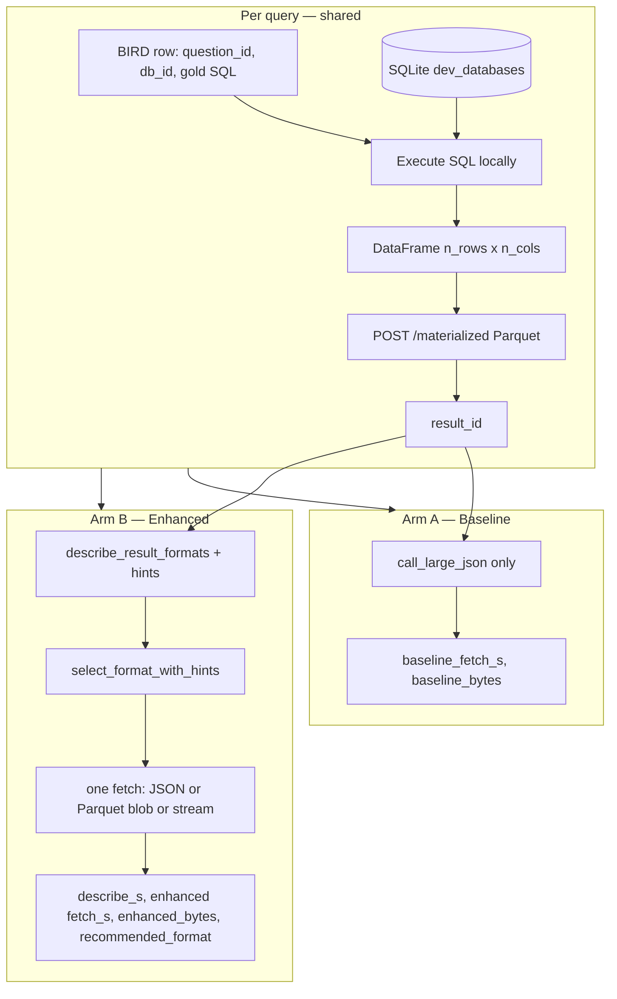
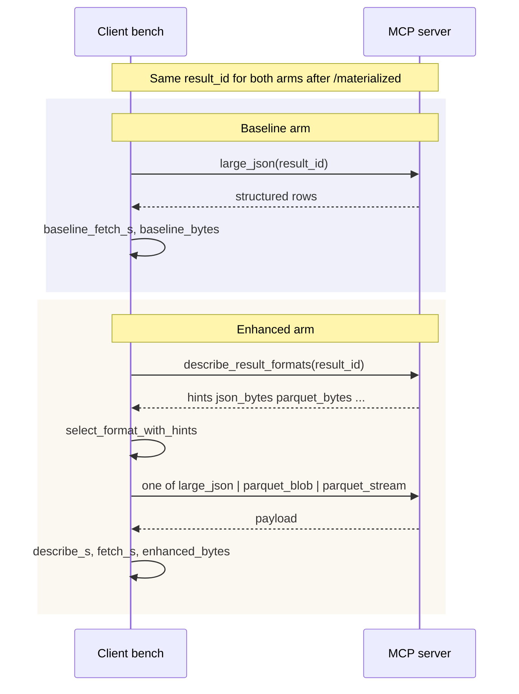

# BIRD transport experiment — methodology (paper notes)

This document specifies **what we measure**, **how we isolate transport from NL2SQL**, and **how to interpret** latency and payload statistics on **real BIRD** data. Use it when writing the methods section of the paper; recorded numbers live in [`results/BIRD_TRANSPORT_BENCHMARKS.md`](../results/BIRD_TRANSPORT_BENCHMARKS.md) and [`results/PAYLOAD_BENCHMARKS.md`](../results/PAYLOAD_BENCHMARKS.md).

**Implementation:** [`bench_bird_e2e.py`](../bench_bird_e2e.py), [`summarize_bird_e2e.py`](../summarize_bird_e2e.py). **Reproduction commands:** [`nl2sql_benchmark.md`](nl2sql_benchmark.md) (BIRD subsection).

---

## 1. Purpose and research questions

We evaluate whether a **materialized-result MCP stack** can deliver SQL answers to a client with **lower wire payload** than a **JSON-only** baseline, and what that implies for **fetch latency**, when the client may choose **JSON**, **Parquet blob**, or **Parquet stream** using **server-provided size hints** and a **deterministic selector** (no LLM in the default path).

**Primary (core) questions — gold SQL:**

1. **Payload:** Over a fixed set of BIRD dev questions, what is the distribution and aggregate sum of **on-the-wire bytes** for “always JSON” vs “hint-aware chosen format”?
2. **Latency:** For the same runs, how do **baseline JSON fetch time**, **enhanced single-fetch time**, and **enhanced describe + fetch** compare (median, p95)?

**Explicitly secondary:** `--sql-source ollama` mixes **NL2SQL quality** and **transport**; we do **not** use it for primary transport claims unless clearly labeled.

---

## 2. What is *not* confounded (isolation)

| Confounder | How we control it |
|------------|-------------------|
| NL2SQL errors / verbosity | **Core runs** use **`--sql-source gold`**: execute the dataset’s **reference SQL** (`SQL` / `sql` in BIRD JSON). No generated SQL. |
| Different result tables | Same SQL string → same `DataFrame` → same registration payload for both arms. |
| Client LLM choosing format | Selection uses **`select_format` / `select_format_with_hints`** in [`format_selector.py`](../format_selector.py) from `(n_rows, n_cols)`, optimization target, and optional byte hints — **no LLM**. |

**Frozen-SQL validation (`--sql-source jsonl`):** Same logical SQL as gold, loaded from a **JSONL artifact** keyed by `(question_id, db_id)`. Validates an alternate ingestion path; numbers should match gold within localhost noise.

---

## 3. Dataset and environment

- **Benchmark:** [BIRD](https://bird-bench.github.io/) **dev** split.
- **Artifacts:** Questions JSON (e.g. `dev.json` or `mini_dev_sqlite.json`) plus **`dev_databases/<db_id>/<db_id>.sqlite`** on disk.
- **Server:** Local MCP + HTTP app (`uvicorn` `server_app:app`), default `http://127.0.0.1:8000`. Client uses **persistent HTTP** (httpx) to the same host.
- **Selector:** `FORMAT_SELECT_TARGET` env (default **`min_latency`**) maps to `OptimizationTarget` in code; **`min_bytes`** is an optional variant documented in payload results.

---

## 4. Per-query pipeline (high level)

For each BIRD row with resolvable SQLite path:

1. **Execute** gold (or frozen) SQL on the question’s database → `pandas` `DataFrame`.
2. **Register** the result: encode as Parquet bytes, **`POST /materialized`** → server returns **`result_id`** (same id for both arms).
3. **Measure two transport protocols** on that **`result_id`** (order and pairing defined in code; both arms use the same materialized result).



---

## 5. Baseline vs enhanced — operational definitions

| Arm | RPC pattern | Latency recorded | Bytes recorded |
|-----|-------------|------------------|----------------|
| **Baseline** | Single **`call_large_json`** (MCP “large result as JSON”). No `describe_result_formats`. | **`baseline_fetch_s`**: wall time for that JSON fetch + local `json.dumps` sizing. | **`baseline_bytes`**: UTF-8 length of the JSON string produced client-side (proxy for MCP JSON payload size). |
| **Enhanced** | **`describe_result_formats`** (hints: JSON vs Parquet sizes, etc.) → **deterministic choice** → **one** fetch in the chosen mode (`json`, `parquet_blob`, or `parquet_stream`). | **`describe_s`** separately; **`enhanced` fetch** = **`fetch_s`** only for the chosen mode. Summaries also report **`median_enhanced_total_s`** ≈ describe + fetch where applicable. | **`enhanced_bytes`**: bytes for the chosen path (JSON string length, downloaded Parquet blob size, or summed stream chunk bytes per benchmark convention). |

**Important:** Baseline is **not** “no MCP” — it is “**transport result as JSON through the same materialized API**.” Enhanced adds **one describe round** before the fetch.



---

## 6. Metrics (aggregated by `summarize_bird_e2e.py`)

| Metric | Definition | Paper use |
|--------|------------|-----------|
| **Median / p95 `baseline_fetch_s`** | Distribution of baseline JSON fetch durations (seconds). | “Typical” vs **tail** latency for JSON-always. |
| **Median / p95 enhanced fetch** | Distribution of **single-fetch** time in the chosen format. | Compare to baseline fetch **when isolating “one round-trip equivalent”** (enhanced still paid describe elsewhere). |
| **Median enhanced total (describe + fetch)** | Sum of describe + fetch for enhanced. | Fairer **client work** comparison vs one baseline hop (still not identical RPC count). |
| **Median / p95 bytes** | Per-query baseline vs enhanced byte counts. | Medians often **tiny** on BIRD; **p95** shows large-answer behavior. |
| **Sum of baseline_bytes / enhanced_bytes** | Sum over all successful transports in a run. | **Aggregate wire volume** — strong story when many queries are small but a minority is large. |
| **`recommended_format` counts** | Histogram of `json` vs `parquet_blob` vs `parquet_stream`. | Shows **how often** Parquet paths activate on real answers. |

**Not included in “transport” headline figures unless stated:** SQLite execution time (`sql_exec_s`), registration (`register_s`), optional NL2SQL (`nl2sql_s`), optional `--with-summary` LLM. These fields exist in per-query JSONL for extended “full pipeline” analysis.

---

## 7. Recorded runs (where to cite numbers)

| Split | Queries | Primary artifact | Summary |
|------|---------|------------------|---------|
| Mini-dev | 500 | `results/bird_e2e_gold.jsonl` | `bird_e2e_gold_summary.md` |
| Full dev | 1534 | `results/bird_e2e_dev_full_gold.jsonl` | `bird_e2e_dev_full_gold_summary.md` |

See [`results/BIRD_TRANSPORT_BENCHMARKS.md`](../results/BIRD_TRANSPORT_BENCHMARKS.md) for tables and interpretation notes. Payload-focused aggregates: [`results/PAYLOAD_BENCHMARKS.md`](../results/PAYLOAD_BENCHMARKS.md).

---

## 8. Limitations and threats to validity

1. **Localhost:** Latency reflects **loopback** HTTP + same-machine server; **not** WAN RTT or cross-region MCP. Payload ratios are more **portable** than absolute milliseconds.
2. **Gold SQL only (core):** Measures **transport** for **correct** reference answers; it does **not** evaluate NL2SQL accuracy or failure modes of generated SQL.
3. **Result cap:** Execution uses a **maximum row cap** (`MAX_RESULT_ROWS` in `bench_bird_e2e.py`) so pathological queries do not dominate; document the cap in the paper if material.
4. **Caching:** Summaries note that for **materialized `result_id`**, certain server LRU caches for synthetic hints do **not** apply to describe; relative baseline vs enhanced on the **same** `result_id` remains meaningful.
5. **Synthetic payload grids:** Optional `bench.py` large grids illustrate **compression ratio** at scale; **primary BIRD claims** should rest on **BIRD JSONL aggregates** unless you explicitly compare to synthetic.

---

## 9. Minimal reproduction (core gold, full dev)

```bash
# Terminal 1
.venv/bin/uvicorn server_app:app --host 127.0.0.1 --port 8000

# Terminal 2 — after data/datasets/bird/dev contains dev.json + dev_databases/
.venv/bin/python bench_bird_e2e.py --sql-source gold \
  --data-dir data/datasets/bird/dev --bird-questions dev.json \
  --max-queries 1534 --overwrite --results results/bird_e2e_dev_full_gold.jsonl

.venv/bin/python summarize_bird_e2e.py --input results/bird_e2e_dev_full_gold.jsonl \
  --md results/bird_e2e_dev_full_gold_summary.md \
  --json-out results/bird_e2e_dev_full_gold_summary.json
```

---

## 10. Suggested paper phrasing (non-results)

> We isolate **downstream MCP transport** from **NL2SQL** by executing **BIRD gold SQL** against each question’s SQLite database, registering the result once, then comparing **(A)** fetching the result **only as JSON** to **(B)** obtaining **format hints** and performing **one** fetch in the **client-selected** representation (JSON or Parquet). Selection uses **deterministic rules** and **byte hints**, not an LLM. We report **per-query bytes**, **sums over the split**, and **latency medians and p95** for baseline and enhanced fetches.

Adjust wording to match venue style; **insert measured numbers** from the `results/*_summary.json` files for the run you freeze as the camera-ready experiment.
