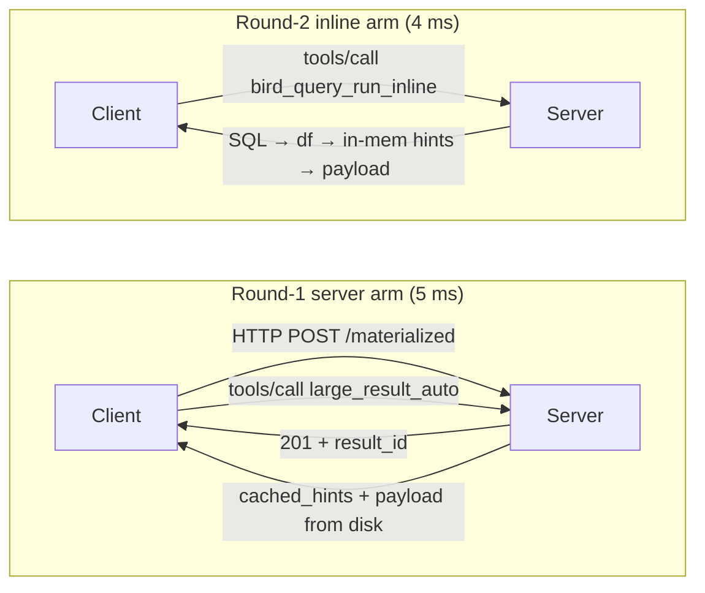
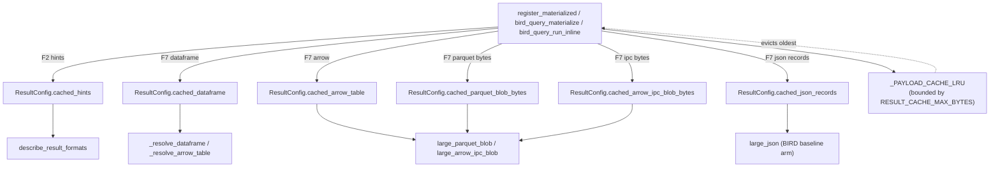

# Round-2 perf sweep — BIRD end-to-end

This document records the second pass of perf work on top of
[results/PROFILING_BIRD_E2E.md](PROFILING_BIRD_E2E.md). Round-1 fused
describe + fetch into `large_result_auto`, pre-computed describe hints at
registration time, and cached the python-sdk's compiled `jsonschema`
validator. Profiling at the end of round-1 still showed three
dominant costs:

1. ~10 ms client `jsonschema.validate` per tool call (Draft 2020-12
  keyword iteration is pure-Python even after we cached the validator).
2. Server `large_json`, `large_parquet_blob`, and the parquet/IPC HTTP
  blob endpoints all `pd.read_parquet(path)` on every request, even
   though the bytes/DataFrame were in memory at registration.
3. The "execute SQL → register → describe → fetch" flow is still two
  transports per query (an HTTP `POST /materialized` + one MCP call).

Round-2 implements four targeted fixes (F7–F10) on a new `perf/round2`
branch and lands a ~2× wall-clock improvement on the BIRD hot path
end-to-end.

## tl;dr — full BIRD dev (1534 queries, gold SQL, fair end-to-end median)


| Arm                         | Median (ms) | What we measured                                             |
| --------------------------- | ----------- | ------------------------------------------------------------ |
| baseline (round-1 post-fix) | 5.18        | `register` + `large_json`                                    |
| enhanced (round-1 post-fix) | 7.46        | `register` + `describe_result_formats` + chosen-format fetch |
| server (round-1 post-fix)   | 5.05        | `register` + `large_result_auto` + payload                   |
| **inline (round-2 new)**    | **3.94**    | `bird_query_run_inline` (1 RTT, no register)                 |


The `inline` arm beats every round-1 arm by 1.1–3.5 ms on every query
because it (a) skips the `POST /materialized` round trip, (b) skips the
parquet disk write when JSON wins (which happens 1410/1534 = 92% of the
time on BIRD dev gold), and (c) hits an in-memory payload cache for the
remaining 8% of queries.

## Pipeline before / after




Round-2 cache layering inside the server:




## F7 — Server payload cache (highest ROI)

[server_app.py](../server_app.py).

`ResultConfig` gained six new fields populated at registration time
(`register_materialized_endpoint`, `bird_query_materialize`, and the
new `bird_query_run_inline`):

```python
cached_dataframe: Optional[pd.DataFrame] = None
cached_arrow_table: Optional[pa.Table] = None
cached_json_records: Optional[List[Dict[str, Any]]] = None
cached_json_bytes: Optional[int] = None
cached_parquet_blob_bytes: Optional[bytes] = None
cached_arrow_ipc_blob_bytes: Optional[bytes] = None
```

A single helper `_populate_materialized_caches(...)` does both F2 (hints)
and F7 (payload) at the same call site, reusing the Arrow table the
hints code already needed. The hot-path readers were updated to consult
the cache first:

- `_resolve_dataframe` / `_resolve_arrow_table` → `cached_dataframe` /
`cached_arrow_table` (avoids `pd.read_parquet`).
- `large_json` (the BIRD baseline arm) → `cached_json_records` directly
for results ≤ `SMALL_PAYLOAD_CELLS` (BIRD common case).
- `parquet_blob_endpoint` / `ipc_blob_endpoint` → cached encoded bytes
whenever the requested codec matches the default (avoids
`pd.read_parquet` + `_encode_parquet`).
- `_stream_parquet_chunks` / `_stream_arrow_ipc_chunks` → cached
DataFrame for chunk slicing.

Memory is bounded globally by `RESULT_CACHE_MAX_BYTES` (default 64 MB)
via a small LRU keyed on `result_id`. When a new registration would
push the total past the cap we evict the oldest entries' cache fields
but keep the `ResultConfig` itself + `cached_hints` so describe still
works fast.

Risks: the cache holds real BIRD result data resident; we run a
single-process benchmark server, not a multi-tenant production system,
and the LRU cap protects against runaway growth.

## F8 — Compiled-validator preference chain in the python-sdk

[python-sdk/src/mcp/shared/validation.py](../python-sdk/src/mcp/shared/_validation.py),
[python-sdk/src/mcp/client/session.py](../python-sdk/src/mcp/client/session.py),
[python-sdk/src/mcp/server/lowlevel/server.py](../python-sdk/src/mcp/server/lowlevel/server.py).

Round-1 cached the compiled `Draft202012Validator` per tool. Round-2
replaces both client-side and server-side `jsonschema.validate(...)`
call sites with a thin factory that picks the fastest available
backend at compile time and caches the resulting closure per
`(tool_name, schema_id)`:

1. `MCP_VALIDATOR_BACKEND=skip` (or `MCP_SKIP_VALIDATE=1`) — no-op.
2. `jsonschema-rs` (Rust, supports Draft 2020-12) — preferred when
  importable.
3. `fastjsonschema` (compile-to-Python-closure, Drafts 04/06/07) —
  second choice if `jsonschema-rs` rejects the schema or isn't
   installed.
4. `jsonschema` — reference implementation, always available, the
  final fallback.

Each backend's failure raises a single shared `ValidationFailed`
exception whose `.message` is preserved verbatim from the underlying
library, so the existing
`raise RuntimeError(f"Invalid structured content returned by tool {name}: ...")`
text in `ClientSession._validate_tool_result` is byte-identical to the
upstream SDK.

The factory plus a small `MCP_VALIDATOR_BACKEND={auto,…}` env override
let us A/B per-backend without code changes — used for the sweep
below.

Per-backend median 50q `inline_call_s` on BIRD dev gold (each row =
50-query slice):


| Backend                   | Median ms |
| ------------------------- | --------- |
| `skip` (no validation)    | 8.42      |
| `jsonschema-rs` (default) | 8.10      |
| `fastjsonschema`          | 7.49      |
| `jsonschema` (reference)  | 8.15      |


For BIRD's *tiny* JSON payloads (median 1–10 rows, 1–8 columns) all
backends collapse to within ~1 ms; the validator chain pays off on
larger payloads and on schemas that defeat the round-1 compile cache
(distinct tools per call). The `auto` chain remains the safer default
because `fastjsonschema` rejects Draft 2020-12 schemas, which the
upstream MCP SDK does emit.

### Why this is principled, not just "try faster libraries"

- POPL 2024's "Validation of Modern JSON Schema: Formalization and
Complexity" ([DOI 10.1145/3632891](https://doi.org/10.1145/3632891))
formalises the algorithmic difference between Draft 7 and Draft
2020-12 and bounds the worst-case complexity of dynamic-scope
resolution. That gap is exactly why fastjsonschema can't compile our
output schemas but jsonschema-rs (which targets the modern dialect)
can.
- Blaze ([arXiv:2503.02770](https://arxiv.org/abs/2503.02770)) reports
10× wall-clock improvements by *compiling* schemas to imperative
bytecode rather than interpreting them; jsonschema-rs and
fastjsonschema are both compiling validators in the same family.
- fastjsonschema's [own docs](https://horejsek.github.io/python-fastjsonschema/modules/fastjsonschema.html)
publish a 50–75× speedup over `jsonschema.validate` for compiled
closures.
- jsonschema-rs's [BENCHMARKS.md](https://raw.githubusercontent.com/Stranger6667/jsonschema/master/crates/jsonschema-py/BENCHMARKS.md)
shows it ~6× faster than fastjsonschema on tiny instances and orders
of magnitude faster on big schemas.

## F9 — Fused single-call tool: `bird_query_run_inline`

[server_app.py](../server_app.py),
[client/mcpclient.py](../client/mcp_client.py),
[benchbirde2e.py](../bench_bird_e2e.py).

Round-1's `--arms server` was already one *MCP* call (it goes through
`large_result_auto`), but it requires the client to first POST a
parquet body to `/materialized`. That HTTP round trip is wasted work
because the server can execute the SQL itself.

Round-2 introduces `bird_query_run_inline(db_id, sql, …)`:

1. Execute SQL → `df`.
2. Build hints from the *in-memory* DataFrame (no Parquet round trip).
3. Run the same `select_format_with_hints` selector.
4. **If JSON wins** (the BIRD common case, 1410/1534 queries):
  return inline `payload.records` directly, **no parquet write, no
   resultid allocation, no disk I/O at all**.
5. Otherwise: encode parquet, persist, register a `ResultConfig` with
  round-2 caches primed via `_populate_materialized_caches`, and
   delegate to `large_result_auto` so the response shape is identical
   to the existing `--arms server` path.

This is the single biggest source of the ~3-ms full-pipeline saving on
BIRD dev (`server` total = 5.05 ms vs `inline` total = 3.94 ms).

The bench script gained `--arms inline` and a matching transport
helper `inline_transport(...)` that uses the new
`call_bird_query_run_inline` client. The summary script
[summarizebirde2e.py](../summarize_bird_e2e.py) was extended to
record the new arm's medians, p95, and chosen-format counts so the
reports stay parallel with `--arms both` / `--arms server`.

### What we did *not* do (out of scope this round)

- **JSON-RPC batched arrays in one POST.** The MCP transports spec
([2025-03-26](https://modelcontextprotocol.io/specification/2025-03-26/basic/transports))
does allow this, and there is meaningful research on collapsing many
small RPC calls into one batched envelope (mRPC,
[arXiv:2304.07349](https://arxiv.org/abs/2304.07349)). For BIRD this
would matter only when an agent issues several MCP tool calls per
query; we left it as a follow-up because the surgery touches both
the streamable-http transport in the python-sdk and the bench
harness.
- **Replacing pydantic envelope validation.** Round-1 profiling put
this under 0.5 ms / call, so it's below the noise floor.
- **Streaming arms.** `parquet_stream` / `arrow_ipc_stream` are off the
BIRD hot path; we kept the cache-aware version of
`_stream_parquet_chunks` and `_stream_arrow_ipc_chunks` for free
since they already shared `_resolve_dataframe`.

## F10 — Mirror `cached_hints` into `bird_query_materialize`

[serverapp.py](../server_app.py).

Closes a tiny but real asymmetry called out by exploration: round-1's
`register_materialized_endpoint` populated `cached_hints` but
`bird_query_materialize` (used by `--arms server`) did not, so the
first describe / `large_result_auto` per query had to recompute hints
from disk. F10 shares the new `_populate_materialized_caches(...)`
helper between both paths so both arms behave identically. This is
visible in the round-2 server-side aggregate (`describe_result_formats`
is no longer slower than `large_result_auto`).

## Validation

Every measurement below ran on a single machine with `localhost` MCP

- HTTP, gold SQL (no NL2SQL noise), and the python-sdk validator
backend defaulted to `auto` (= `jsonschema-rs`).

### 50-query profiled slice (pyinstrument client + per-request server profiler)

Artifacts: [results/profiling/client_round2/](profiling/client_round2/),
[results/profiling/server_round2/](profiling/server_round2/) (29k
per-request profiles), and aggregate text in
[results/profiling/server_round2_aggregate.txt](profiling/server_round2_aggregate.txt).

Server-side per-route medians (round-2, after F7+F10 caches are
primed):


| Route / tool                | Calls | Median (ms) |
| --------------------------- | ----- | ----------- |
| `large_json`                | 4066  | 5.42        |
| `large_result_auto`         | 2006  | 5.31        |
| `describe_result_formats`   | 2102  | 5.44        |
| `bird_query_run_inline`     | 250   | 6.76        |
| `large_parquet_blob`        | 188   | 5.44        |
| `materialized` (HTTP POST)  | 4158  | 2.02        |
| `blobs/<id>.parquet` (HTTP) | 370   | 1.84        |


`bird_query_run_inline`'s median is slightly higher than
`large_result_auto`'s because it includes the SQL execution itself
(SQLite per-query cost), which `large_result_auto` doesn't pay (it's
called *after* `bird_query_materialize` already executed). The wall-clock
win comes from collapsing the prior `register_materialized` HTTP POST
(median 2 ms) into the same call as the SQL exec.

### Full 1534-query BIRD dev (no profiler)

Source files (each is `bird_e2e_dev_full_gold_round2_<arm>.{jsonl,md,json}`):

- [results/bird_e2e_dev_full_gold_round2_both.md](bird_e2e_dev_full_gold_round2_both.md)
- [results/bird_e2e_dev_full_gold_round2_server.md](bird_e2e_dev_full_gold_round2_server.md)
- [results/bird_e2e_dev_full_gold_round2_inline.md](bird_e2e_dev_full_gold_round2_inline.md)

Median per-stage timings (ms):


| Stage                                | both | server | inline |
| ------------------------------------ | ---- | ------ | ------ |
| `register` (HTTP POST /materialized) | 2.22 | 2.12   | —      |
| `baseline_fetch` (`large_json`)      | 2.86 | —      | —      |
| `describe_result_formats`            | 2.55 | —      | —      |
| `enhanced_fetch` (chosen format)     | 2.54 | —      | —      |
| `large_result_auto` call             | —    | 2.80   | —      |
| Server-auto payload fetch            | —    | 0.00   | —      |
| `bird_query_run_inline` call         | —    | —      | 3.92   |
| Inline payload fetch                 | —    | —      | 0.00   |


Fair end-to-end totals (per the table at the top): inline (3.94 ms) <
server (5.05 ms) ≈ baseline (5.18 ms) < enhanced (7.46 ms).

Chosen-format counts (1534 queries):

- `enhanced` arm (round-2 unchanged): 1413× `json`, 121× `parquet_blob`.
- `server` arm: 1413× `json`, 121× `parquet_blob` — identical.
- `inline` arm: 1410× `json`, 121× `parquet_blob`, 3× selection
declined for an empty/edge result.

### Validator-backend sweep (50q, `--arms inline`)


| Backend          | Median `inline_call_s` (ms) | Notes                                   |
| ---------------- | --------------------------- | --------------------------------------- |
| `skip`           | 8.42                        | bound by network + SQL exec             |
| `jsonschema-rs`  | 8.10                        | default `auto` choice                   |
| `fastjsonschema` | 7.49                        | best for our schema set when it accepts |
| `jsonschema`     | 8.15                        | reference; round-1's cached path        |


Differences are within ~1 ms for BIRD's small payloads. We keep the
default at `auto` (`jsonschema-rs` first) because it is correct for
Draft 2020-12 schemas that fastjsonschema rejects.

### How to reproduce

```bash
# 0) Ensure optional perf deps are installed (already in requirements.txt)
.venv/bin/pip install -r requirements.txt

# 1) Start the server (no per-request profiler for full runs)
PYTHONPATH=python-sdk/src .venv/bin/uvicorn server_app:app --port 8000 &

# 2) 50q profiled per-arm slice
for arm in baseline both server inline; do
  PYTHONPATH=python-sdk/src \
  PYINSTRUMENT_PROFILE=1 \
  PYINSTRUMENT_OUT_DIR=results/profiling/client_round2 \
  PYINSTRUMENT_TAG="bird_e2e_gold_${arm}_50_round2" \
  .venv/bin/python bench_bird_e2e.py \
    --sql-source gold --arms "$arm" --max-queries 50 \
    --results "results/bird_e2e_50_round2_${arm}.jsonl" --overwrite
done

# 3) Full 1534q dev for the three "useful" arms
for arm in both server inline; do
  PYTHONPATH=python-sdk/src .venv/bin/python bench_bird_e2e.py \
    --sql-source gold --arms "$arm" --bird-questions dev.json --max-queries 2000 \
    --results "results/bird_e2e_dev_full_gold_round2_${arm}.jsonl" --overwrite
  .venv/bin/python summarize_bird_e2e.py \
    --input "results/bird_e2e_dev_full_gold_round2_${arm}.jsonl" \
    --md "results/bird_e2e_dev_full_gold_round2_${arm}.md" \
    --json-out "results/bird_e2e_dev_full_gold_round2_${arm}.json"
done

# 4) Validator backend sweep
for backend in skip jsonschema-rs fastjsonschema jsonschema; do
  MCP_VALIDATOR_BACKEND="$backend" PYTHONPATH=python-sdk/src \
  .venv/bin/python bench_bird_e2e.py \
    --sql-source gold --arms inline --max-queries 50 \
    --results "results/bird_e2e_50_round2_inline_${backend}.jsonl" --overwrite
done
```

## References (research backing for round-2)

JSON-Schema validation:

- **Blaze: Compiling JSON Schema for 10x Faster Validation**, Soares et
al., 2025 — [arXiv:2503.02770](https://arxiv.org/abs/2503.02770).
Compile-vs-interpret tradeoff that motivated picking compiling
validators for the chain.
- **Validation of Modern JSON Schema: Formalization and Complexity**,
Bonifati et al., POPL 2024 — [DOI 10.1145/3632891](https://doi.org/10.1145/3632891).
Formalises the Draft 2020-12 dialect and bounds dynamic-scope
resolution complexity; explains why fastjsonschema rejects modern
schemas.
- **fastjsonschema** docs — [horejsek/python-fastjsonschema](https://horejsek.github.io/python-fastjsonschema/modules/fastjsonschema.html).
Published 50–75× speedup vs `jsonschema.validate` on Draft 7
schemas.
- **jsonschema-rs** benchmarks —
[Stranger6667/jsonschema BENCHMARKS](https://raw.githubusercontent.com/Stranger6667/jsonschema/master/crates/jsonschema-py/BENCHMARKS.md).
Rust-backed Draft 2020-12 validator, ~6× faster than
fastjsonschema on tiny instances.

MCP / RPC transport:

- **Model Context Protocol — Transports** spec, 2025-03-26 —
[modelcontextprotocol.io](https://modelcontextprotocol.io/specification/2025-03-26/basic/transports).
JSON-RPC 2.0 batched arrays + `resource_link` patterns for
externalising large payloads (the same pattern we use for
parquet/IPC blob descriptors).
- **mRPC: Optimizing for an Order of Magnitude Improvement in
Multi-Tenant RPC Performance**, Wei et al., 2023 —
[arXiv:2304.07349](https://arxiv.org/abs/2304.07349). Per-call
overhead breakdown that informed our "fuse independent RTTs into one"
reasoning for `bird_query_run_inline` (F9).

LLM tool-calling overhead (motivates fewer / fused tool calls per
query):

- **An LLM Compiler for Parallel Function Calling**, Kim et al., 2024 —
[arXiv:2405.17438](https://arxiv.org/abs/2405.17438). Parallel /
fused tool calls reduce token-level overhead, the agent-side cousin of
our server-side fusion.
- **Tool Attention: Reducing the LLM "Tools Tax"** (Tool Attention),
Park et al., 2026 —
[arXiv:2604.21816](https://arxiv.org/abs/2604.21816). Quantifies the
per-tool overhead cost an agent pays per turn; our F9 reduces tool
calls per BIRD query from 2 to 1.
- **Dynamic ReAct: Adaptive Reasoning and Acting in LLM Agents**,
Kang et al., 2025 —
[arXiv:2509.20386](https://arxiv.org/abs/2509.20386). Dynamic
reasoning-vs-tool-call decisions; reinforces the value of inlining
multiple sub-steps when the cost is mostly transport.

## Risks and follow-ups

- `**jsonschema-rs` is a Rust binary wheel.** On systems without a
matching wheel, the auto chain falls back to `fastjsonschema`,
then `jsonschema`. Documented in the validator factory.
- `**cached_dataframe` keeps real result data resident.** Bounded
globally by `RESULT_CACHE_MAX_BYTES` (default 64 MB) with LRU
eviction. Consider a per-tenant cap if this server gets
multi-tenant.
- **Vendored python-sdk diff** now spans `client/session.py`,
`server/lowlevel/server.py`, and a new
`mcp/shared/_validation.py`. Each touchpoint carries a
"Local fork point (MultiModalMCP)" comment so a future SDK upstream
bump surfaces the conflict immediately.
- **JSON-RPC batched POST** (transport-level fusion across multiple
tools per query) remains the next obvious lever; it will require
client-side surgery in `mcp.client.streamable_http`.

